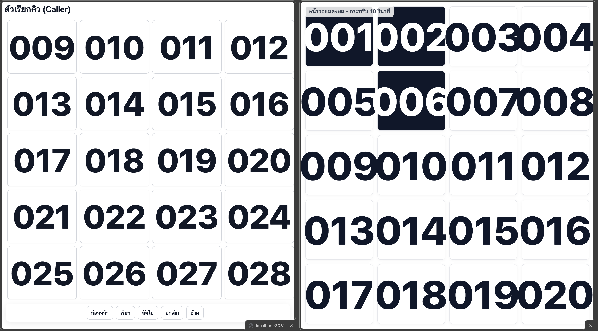

## Screenshot



You said:
คุณคือผู้เชี่ยวชาญระบบคิว และเภสัชกร มากกว่า 10 ปีอยากได้ระบบคิว กดเรียกและแสดงผล โดยกดเรียกคิวแสดงตัวเลขเป็นตาราง 5 x 4 เมื่อกดแล้วให้แสดงสถานะว่าเลขนี้เรียกไปแล้ว และเก็บลง mysql
  ระบบคิวเรียกได้แบบ ครั้งนึ่งหลาย หมายเลขเช่น 001,002,003,004 โดยมีช่องแสดงเลขที่กดรอส่งไปหน้าจอ และเลขที่กดไปจะเปลี่ยนสีให้ user รู้ว่ากดไปแล้ว  และสามารถกดยกเลิกได้ หรือ กดข้ามได้ ไม่ต้องเรียงหมายเลข และมี เสียงเรียก dingdong.mp3 หน้าจอเรียกเป็นแบบเดียวกันกับตัวเรียกป็นตาราง 5 x 4 เมื่อกด ให้แสดงหมายเลขที่กด อยู่ตำแหน่งเดียวกันกับตัวเรียก  กระพริบ สิบวินาที ใช้งานบน window มีตัวเรียกคิว กับตัวแสดงหน้าจอ บนทีวีใช้บนเครื่องเดียวกันสอง ต่อสองจอ หรือ แยกเครื่องกันก็ได้ แบบง่ายไม่ยุ่งยากเก๋บข้อมูล mysql
เป้าหมาย
สร้าง spec ขอ solution ยังไม่เขียน code ควรใช้เครื่องมืออะไร
ChatGPT said:
ได้เลยครับ ผมขอสวมบท ผู้เชี่ยวชาญระบบคิว + เภสัชกรที่ทำงานหน้าห้องยา >10 ปี แล้วสรุปเป็น SPEC + SOLUTION ระดับใช้งานจริง
ยังไม่ลงโค้ด ตามที่ขอ 👍
อธิบายเป็นภาษาไทย เข้าใจง่าย และเน้น ทำได้จริง / ดูแลง่าย / ไม่ยุ่งยาก


Tool List (สรุปสั้นๆ)
ต้องมี

✅ PHP 8.x

✅ MySQL / MariaDB

✅ Apache / Nginx

✅ Browser (Chrome / Edge)

เสริม

Bootstrap

jQuery (ถ้าถนัด)

WebSocket (optional)


🎯 เป้าหมายระบบ (Business Goal)
ระบบคิวสำหรับ ห้องยา / จุดจ่ายยา

เรียกคิวแบบ ไม่ต้องเรียง

เรียกทีละหลายหมายเลขได้ (001–004)

แสดงผลเป็น ตาราง 5 x 4

เห็นชัดว่า เลขไหนเรียกแล้ว / ยังไม่เรียก

มี เสียงเรียก + กระพริบ 10 วินาที

ใช้ได้ทั้ง

เครื่องเดียว 2 จอ (เคาน์เตอร์ + TV)

หรือ แยกเครื่อง (LAN/WiFi)

เก็บข้อมูลลง MySQL

ดูแลง่าย ไม่ซับซ้อน

🧠 แนวคิดหลักของระบบ (Concept)
Queue is a State Machine

หมายเลขแต่ละตัวมี “สถานะ” ชัดเจน
ไม่เน้นลำดับ → เน้นการ กดเรียกและแสดงผล

```
# QQ Queue System

Minimal web-based queue system for a 5x4 display (Caller + Display) with MySQL storage.

This repository contains a working Node.js example (Express) and static frontends, plus DB init and seed scripts. Use the `SPEC.md` for a cross-language specification and UX guidelines.

## Quick start (local development)

Prerequisites:

Default DB credentials used in examples (change to match your environment):

```text
host: 127.0.0.1
user: supervisor
password: saas
database: qq
```

Commands:

```bash
# install deps
npm install

# initialize DB and seed 20 rows
node db/seed.js

# start server (default port 8080)
PORT=8080 npm start

# run smoke test against the running server
PORT=8080 node test/smoke.js
```

If port 8080 is already in use, pick another port: `PORT=8081 npm start`.

## Project structure


## Notes

## Contributing / Next steps


If you'd like, I can also: create a `.gitignore` (I will add it), generate a concise `UX_GUIDELINES.md`, or produce a Python/Flask example server following the same spec.


